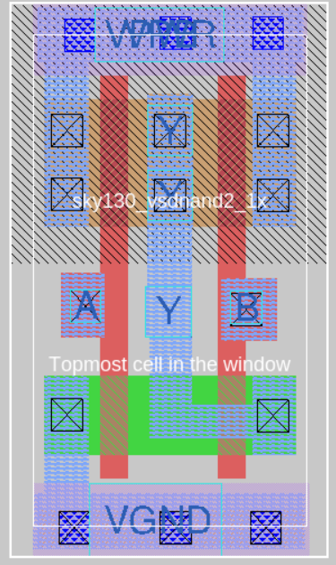
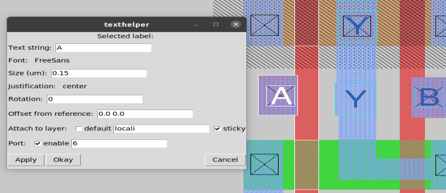
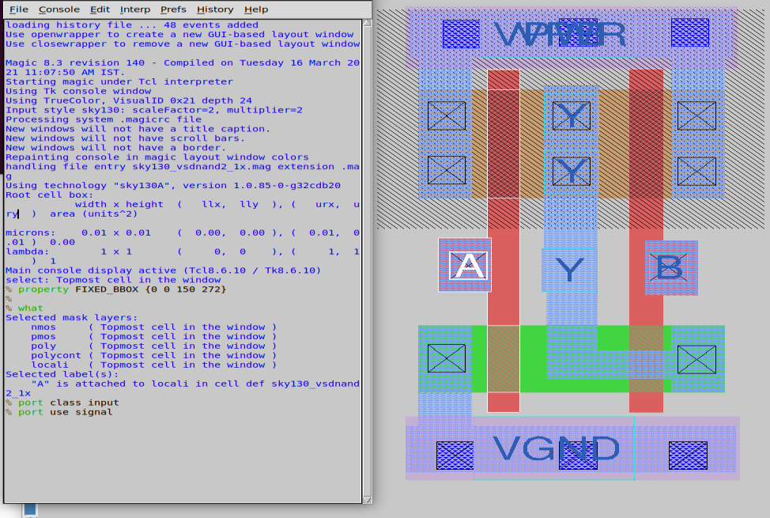
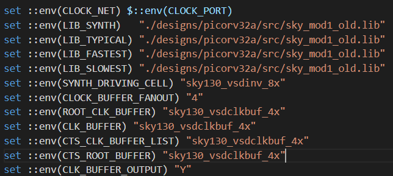
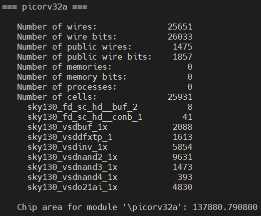
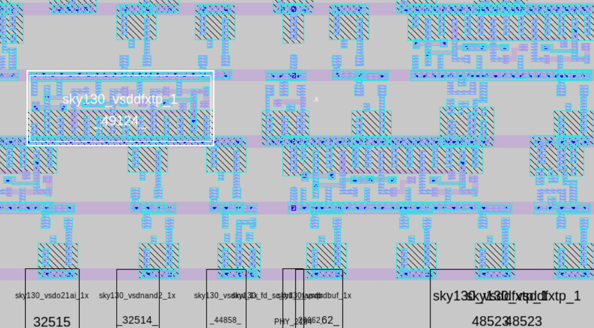
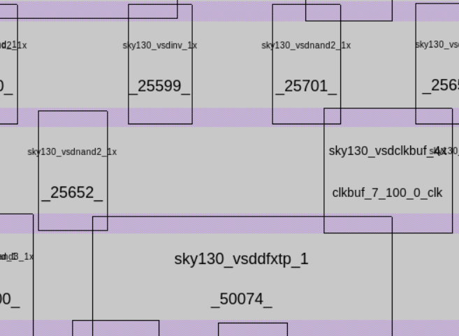

# Standard Cell List Sky 130
This repository contains the standard cells designed for the characterization which uses NGSPICE for simulation , Magic for Layout, and [Characterizing tool](https://github.com/vsdip/vsdStdCellCharacterizer_sky130) 

- [Custom Standard Cell Design using Skywater 130nm PDK](#custom-standard-cell-design-using-skywater-130nm-pdk)
- [Standard Cell List](#Standard-Cells-Designed-List)
- [About PicoRV32](#About-PicoRV32)
- [Standard Cell Layout Design in Magic](#Standard-Cell-Layout-Design-in-Magic)
   - [Magic](#Magic)
   - [Create Port Definations](#Create-Port-Definations)
   - [Set port class and use](#Set-port-class-and-use-attributes-for-a-layout)
- [Extracting LEF, ext and spice file](#Extracting-LEF-ext-and-spice-File)
- [Plugging custom LEF to OPENlane Flow](#Plugging-custom-LEF-to-openlane-flow)
- [Verification of generated Liberty File with OpenLane](#verification-of-generated-liberty-file-with-openlane)
   - [OpenLane Requirements](#openlane-requirements)
   - [Custom Cells and Skywater 130nm Cells:](#custom-cells-and-skywater-130nm-cells)
   - [Synthesis](#synthesis)
   - [Floor-planning](#floor-planning)
   - [Placement](#placement)
   - [CTS](#cts)
   - [Routing:](#routing)
- [Future Works:](#future-works)
- [Acknowlegdement](#Acknowledgement)
- [Contact Info](#Contact-Information)
 

## Standard Cells Designed list

1. Nand2
2. Nand3
3. Nand4
4. o21ai
5. inv
6. inv_8x
7. buf
8. clk buf
9. conb

## About PicoRV32
PicoRV32 is a CPU core that implements the RISC-V RV32IMC Instruction Set. It can be configured as RV32I, RV32IC, RV32IM, or RV32IMC core; where the suffixes stand for:

I - Base Integer Instructions
M - Multiply extension
C - Compressed Instructions
PicoRV32 is free and open hardware licensed under the ISC license. All features and data-sheet related to picoRV32 core can be obtained [here](https://www.github.com/cliffordwolf/picorv32).

## Standard cell layout design in Magic

 [Pre_layout](Standard_cells/nand2_1x/nand2.spice)  |  [Post_layout](Standard_Cells/nand2_1x/sky130_vsdnand2_1x.spice)
 
 

### Magic
  The magic tool can be invoked using the following command `magic -T sky130A.tech` where the sky130A.tech is the technology file has also been included in repo. The proposed designs are single height standard cell, so the dimensions needs to be a multiple of the single height place site.
Thus, the first step in magic layout tool is to create a bounding box with a height of 2.72 and width according to the size of cell. This can be done by using command `property FIXED_BBOX {0 0 w 272}`, here the width(w) is variable, in magic tkcon window.

After the box is defined define the ground and power segments (in metal 1), the respective contacts and finally the layout of the logic part. Same procedure can be followed for all standard cell layout.The metal tracks of same layer for same purpose should have same width. If a metal1 power pin is 2μm wide, all cells in the library must use 2μm wide metal1 power connections. Power and ground pins should have same width and should run in the same directions – all horizontal or all vertical.

The already created layouts can be viewed using `magic -T sky130A.tech name.mag` here name represents the mag file name.

#### Create port definition

Certain definations and properties are required to be set for the pins of the cell which helps the placement and routeing tool. For LEF files, a cell that contains ports is written as a macro cell, and the ports are the declared PINs of the macro. Our objective is to extract LEF from a given layout in standard format. Defining port and setting correct class and use attributes to each port. To define a port:

    `Edit >> Text` this opens a dialog box. 

For each layer (to be used as port), make a box on that particular layer and input a label name along with a sticky label of the layer name with which the port needs to be associated. Ensure the Port enable checkbox is checked and default checkbox is unchecked as shown in the figure:

 

In the above two figures, port A (input port) and port Y (output port) are taken from locali (local interconnect) layer. 

For power and ground layers, the definition could be same or different than the signal layer. Here, ground and power connectivity are taken from metal1 (Notice the sticky label)
VPWR	VGND
#### Set port class and port use attributes for a layout

After port definition, the next step is setting port class and port use attributes. The "class" and "use" properties of the port have no internal meaning to magic but are used by the LEF and DEF format read and write routines, and match the LEF/DEF CLASS and USE properties for macro cell pins. Valid classes are: default, input, output, tristate, bidirectional, inout, feedthrough, and feedthru. Valid uses are: default, analog, signal, digital, power, ground, and clock. These attributes are set in tkcon window (after selecting each port on layout window. A keyboard shortcut would be repeatedly pressing s till that port gets highlighed) as:

 

To delete or remove any port by first selecting the port (key s) and then executing below two commands in order (in tkcon window):

          port remove
          erase labels
          
          
### Extracting LEF , ext and spice file

With the help of `lef write` command in the tkon window LEF file is extracted. 

To extract the ext and spice fileuse following commands:

     % extract all
     % ext2spice cthresh 0 rthresh 0
     % ext2spice

### Plugging custom LEF to openlane flow
If a new custom cell needs to be plugged into openlane flow, include the lefs as below:

In the design's config.tcl file add the below line to point to the lef location which is required during spice extraction.

    set ::env(EXTRA_LEFS) [glob $::env(OPENLANE_ROOT)/designs/$::env(DESIGN_NAME)/src/*.lef]
Include the below command to include the additional lef into the flow:

    set lefs [glob $::env(DESIGN_DIR)/src/*.lef]
  
    add_lefs -src $lefs

### Verification of generated Liberty File with OpenLane

#### OpenLane Requirements
* Install OpenLane as mentioned in repo [OpenLANE Built Script](https://github.com/nickson-jose/openlane_build_script)
* [OpenLane Workshop repo for understanding openLane flow](https://github.com/mayurpohane17/OpenLANE-Sky130-Workshop)

#### Synthesis
* Designed used for verification: picorv32a   
* Edit config.tcl to -      
  
* Synthesis Result:   
  

#### Floor-planning
* Command: `run_floorplan`   
* Layout can be viewed in magic with predefined taps, io pins and decoupling Caps: `magic -T ~/sky130A.tech lef read ~/merged.lef def read picorv32a.floorplan.def`

#### Placement
 * Command: `run_placement`
 * Layout:    
    

#### CTS
* Command: `run_cts`
* Layout:   
  

#### Routing:
* Command: `run_routing`
* Global Routing done, Detailed routing running from 2 days and still hyave voilations around 42K.
  
## Future Works: 
* Improve the layout of custom cells for the routing.

## Acknowledgement
- Harsh Shukla
- Kunal Ghosh, Co-founder, VSD Corp. Pvt. Ltd

## Contact Information
- Mayur Pohane, mayur17pohane@gmail.com
- Kunal Ghosh, Co-founder, VSD Corp. Pvt. Ltd. kunalpghosh@gmail.com
